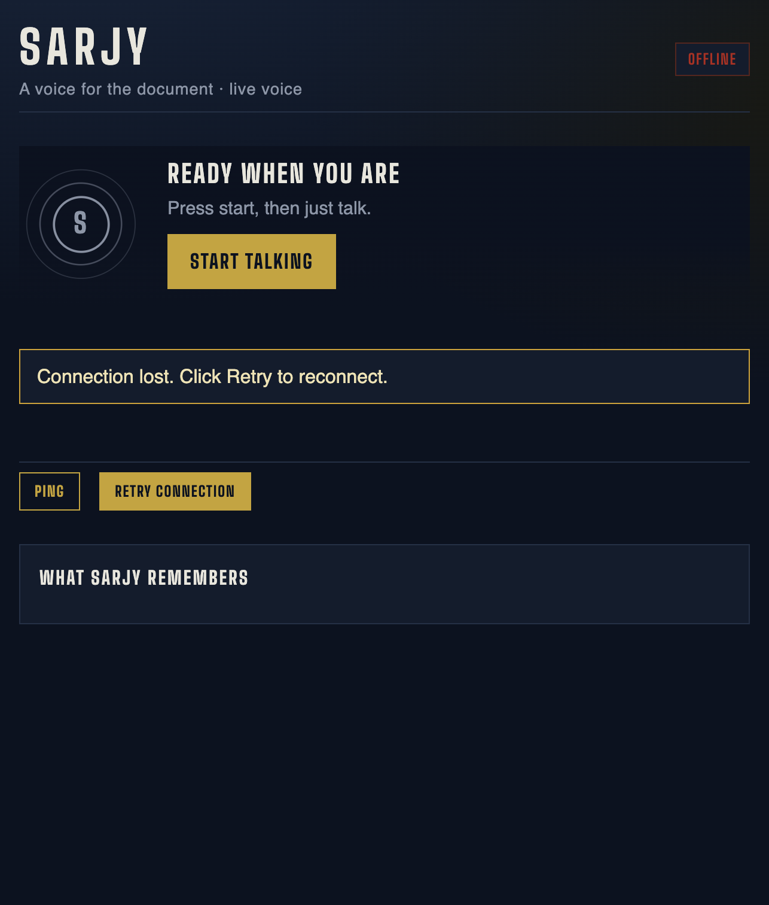

# PR_DEMOABLE — travel-agent UI (Block C2)

## Summary

The screen is a trip dossier that grows. Turns append. Sourced visa facts land as an ivory document; Sarjy's recommendations land as Wikipedia-attributed photo picks; an audio-reactive orb is the persona. Guardrails stay the named deep dive; the UI is how a reviewer sees them without reading a log.

## Problem

The previous UI restyled a **single-turn screen**. `handleUtterance` nulled transcript, reply, segments, and the fact card on every turn, so a four-question demo ended looking like a one-question demo. Judgement — the actual travel-agent value — rendered as audit-log residue. The circular medallion carried no information. Place suggestions had been cut for lack of a sourced image API.

## Solution

1. **Dossier.** Per-turn scalars became a `Turn[]`. Callbacks patch by id. Existing `useRef`s (timing, barge, playback, detector) were not rewritten.
2. **Shell.** Night / brass / one ivory document. Vendored Big Shoulders. State headline is the conversation state. Header says CONNECTED, not LIVE.
3. **Orb.** Concentric SVG rings. Mic level from an `AnalyserNode` on the shared MediaStream; speaking level from PCM RMS of chunks already passing through `onAudioChunk`. `playback.ts` / `capture.ts` untouched. rAF writes CSS custom properties — never `setState` at 60fps. `prefers-reduced-motion` skips the loop.
4. **Places.** Wikimedia `action=query` (no key, no quota). Fetches run **after** TTS is handed the answer, concurrent via `asyncio.gather`. `place` only on `judgement` lines; the gate is unchanged. Failed lookups render as text with a reason, never a broken image.
5. **Documents.** README, demo script, Loom outline, written against what is true.

Arabic, both rungs, was cut to pay for this. **Superseded 2026-09-21:** Arabic rungs 1–2, the mic rewrite, and the now/trail/dossier surface are in `docs/PRs/PR_NEXT_LEVEL.md`.

## Changes

- `frontend/src/App.tsx` — turns array, layout, copy, orb wiring
- `frontend/src/index.css` — rewritten
- `frontend/src/ui/FactCard.tsx`, `Orb.tsx`, `PlaceStrip.tsx`
- `frontend/src/audio/level.ts`
- `frontend/src/protocol.ts`, `net/connection.ts` — additive `places` message
- `frontend/public/fonts/` — Big Shoulders 600/700 woff2
- `backend/app/tools/places.py`, `tests/test_places.py`
- `backend/app/pipeline/{turn,protocol}.py`, `prompts.py`, `main.py`
- `README.md`, `docs/DEMO-SCRIPT.md`, `docs/LOOM-OUTLINE.md`

PROTOCOL_VERSION stays 5 (`places` is additive).

## How to Test

```bash
cd backend && make typecheck && make lint && make test
cd frontend && npm run typecheck && npm run lint && npm run build
```

**2026-09-21, this environment:**

- backend `mypy`: clean (30 files)
- backend `ruff`: clean
- backend `pytest`: **306 passed**
- frontend `tsc --noEmit`: clean
- frontend `eslint --max-warnings 0`: clean
- frontend `vite build`: clean
- eval: `eval/results/2026-09-21-gate-eval-raw.txt` (13 cases; 3 Gemini timeouts named in the scored table)

Then, against the **deployed** URL after `make deploy` (Omar-only from this environment):

| # | Do | Status |
|---|---|---|
| V1 | Cold open at 1280×800 | **Not run here** — no deploy from an agent |
| V2 | Start talking → Japan. Watch the orb through all four states | Not run here (no microphone in this environment) |
| V3 | Card values identical to spoken sourced segments | Not run here |
| V4 | `?gate_demo=1` | Not run here |
| V5 | Uncovered pair → refusal card | Not run here |
| V6 | Deny the mic, then Retry | Not run here |
| V7 | Four-turn conversation, dossier grows, place strip has photos and dates | Not run here |

Unit tests cover Wikimedia reject rules (happy path, 404, disambiguation, no image, timeout, invalid title, cache, cap-at-three) and that `PlacesOut` is yielded **after** `AudioStartOut`.

Local idle screenshot (frontend `vite preview`, no backend — so OFFLINE / Retry is the honest failure path, Invariant 7):



## Changelog

- `feat(ui): the trip dossier — turns accumulate, the screen is the receipt`
- `feat(ui): audio-reactive orb — the persona is driven by the real graph`
- `feat(places): Wikimedia lookups for sourced photo picks`
- `docs: README, demo script and Loom outline for submission`
